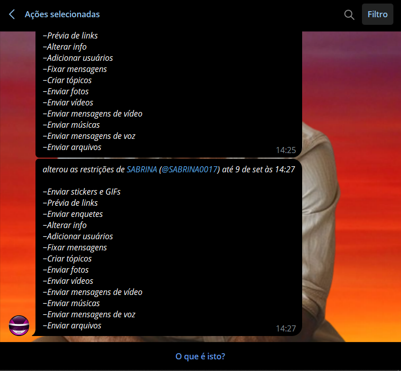
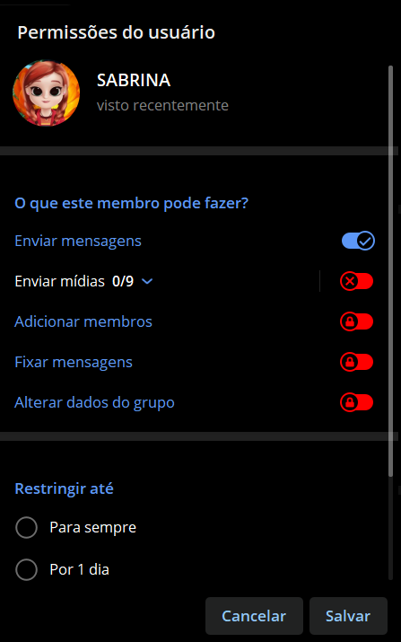
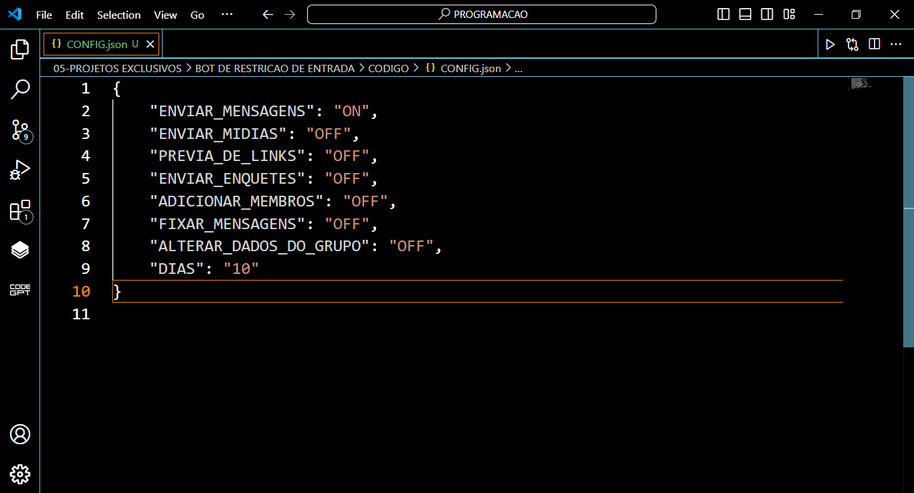

# BOT DE RESTRICAO DE ENTRADA
🤖ESSE É UM BOT DO TELEGRAM QUE APLICA RESTRIÇÕES AUTOMÁTICAS A NOVOS MEMBROS QUE ENTRAM EM GRUPOS.

 <br>
 <br>
 <br>

## DESCRIÇÃO:
Este bot para Telegram aplica restrições automáticas a novos membros que entram em grupos. Ele utiliza um arquivo de configuração (`CONFIG.json`) para definir as permissões e restrições aplicadas aos novos membros, com base nas configurações especificadas.

## FUNCIONALIDADES:
1. **Restrições Baseadas em Configuração**:
   - **Mensagens**: Permite ou restringe o envio de mensagens de texto.
   - **Mídias**: Controla o envio de mídias (imagens, vídeos, stickers, etc.) com base na configuração geral de mídia.
   - **Prévia de Links**: Controla se é permitido enviar prévias de links.
   - **Enquetes**: Permite ou restringe o envio de enquetes.
   - **Adicionar Membros**: Restringe a capacidade de adicionar novos membros ao grupo.
   - **Fixar Mensagens**: Permite ou restringe a fixação de mensagens no grupo.
   - **Alterar Dados do Grupo**: Restringe a capacidade de alterar as informações do grupo.

2. **Controle de Duração**:
   - As restrições podem ser aplicadas por um número específico de dias ou indefinidamente (para sempre), conforme especificado no arquivo de configuração.

3. **Aplicação Automática de Restrições**:
   - Quando um novo membro entra no grupo, o bot aplica automaticamente as permissões configuradas para esse membro, com base nas regras definidas.

## COMO USAR?
1. **Instale as bibliotecas necessárias:** Antes de executar o bot, certifique-se de instalar todas as dependências necessárias. No terminal, execute o seguinte comando para instalar as dependências listadas no arquivo requirements.txt em `CODIGO`:
   ```bash
   pip install -r requirements.txt
   ```
   
2. **Coloque o Token:**
   - Antes de executar o bot, é necessário substituir pelo seu token no arquivo `TOKEN.py`, o qual pode ser obtido por meio do [@BotFather](https://t.me/BotFather).
  
3. **Adicionar o Bot a um Grupo:** 
   - Adicione o bot ao grupo do Telegram como Administrador. 

4. **Executar o Bot:** 
   - Execute o bot do Telegram em Python iniciando-o com o seguinte comando no diretório `./CODIGO`:
   ```bash
   python MAIN.py
   ```

## COMO USAR O `CONFIG.json`?
O arquivo `CONFIG.json` é usado para definir as permissões e restrições aplicadas aos novos membros de um grupo no Telegram. O bot lê este arquivo para configurar automaticamente as permissões quando um novo membro entra no grupo.

### ESTRUTURA:
O arquivo `CONFIG.json` deve estar no formato JSON e incluir as seguintes chaves:

```json
{
   "ENVIAR_MENSAGENS": "ON",
   "ENVIAR_MIDIAS": "OFF",
   "PREVIA_DE_LINKS": "OFF",
   "ENVIAR_ENQUETES": "OFF",
   "ADICIONAR_MEMBROS": "OFF",
   "FIXAR_MENSAGENS": "OFF",
   "ALTERAR_DADOS_DO_GRUPO": "OFF",
   "DIAS": "10"
}
```

### DESCRIÇÃO:
- **`ENVIAR_MENSAGENS`**: Define se o membro pode enviar mensagens de texto. Valores possíveis: `"ON"`, `"OFF"`.
- **`ENVIAR_MIDIAS`**: Controla o envio de mídias (imagens, vídeos, stickers, etc.). Valores possíveis: `"ON"`, `"OFF"`.
- **`PREVIA_DE_LINKS`**: Permite ou restringe o envio de prévias de links. Valores possíveis: `"ON"`, `"OFF"`.
- **`ENVIAR_ENQUETES`**: Permite ou restringe o envio de enquetes. Valores possíveis: `"ON"`, `"OFF"`.
- **`ADICIONAR_MEMBROS`**: Restringe a capacidade de adicionar novos membros ao grupo. Valores possíveis: `"ON"`, `"OFF"`.
- **`FIXAR_MENSAGENS`**: Permite ou restringe a fixação de mensagens. Valores possíveis: `"ON"`, `"OFF"`.
- **`ALTERAR_DADOS_DO_GRUPO`**: Restringe a capacidade de alterar as informações do grupo. Valores possíveis: `"ON"`, `"OFF"`.
- **`DIAS`**: Define por quantos dias as restrições serão aplicadas ou se devem ser aplicadas indefinidamente (`"SEMPRE"`). Valores possíveis: `"SEMPRE"`, ou um número de dias como `"10"`.

### EXEMPLO DE CONFIGURAÇÃO:
- **Permitir todos os envios e sem restrições de tempo**:

    ```json
    {
      "ENVIAR_MENSAGENS": "ON",
      "ENVIAR_MIDIAS": "ON",
      "PREVIA_DE_LINKS": "ON",
      "ENVIAR_ENQUETES": "ON",
      "ADICIONAR_MEMBROS": "ON",
      "FIXAR_MENSAGENS": "ON",
      "ALTERAR_DADOS_DO_GRUPO": "ON",
      "DIAS": "SEMPRE"
    }
    ```

- **Restringir envios e aplicar restrições por 10 dias**:

    ```json
    {
      "ENVIAR_MENSAGENS": "OFF",
      "ENVIAR_MIDIAS": "OFF",
      "PREVIA_DE_LINKS": "OFF",
      "ENVIAR_ENQUETES": "OFF",
      "ADICIONAR_MEMBROS": "OFF",
      "FIXAR_MENSAGENS": "OFF",
      "ALTERAR_DADOS_DO_GRUPO": "OFF",
      "DIAS": "10"
    }
    ```

Certifique-se de que o arquivo `CONFIG.json` está corretamente formatado e localizado no mesmo diretório que o seu script Python para que o bot possa carregar e aplicar as configurações conforme esperado.

## NÃO SABE?
- Entendemos que para manipular arquivos em muitas linguagens e tecnologias relacionadas, é necessário possuir conhecimento nessas áreas. Para auxiliar nesse aprendizado, oferecemos alguns subsidios:
* [CURSO DE TELEBOT](https://github.com/VILHALVA/CURSO-DE-TELEBOT)
* [CURSO DE PYTHON](https://github.com/VILHALVA/CURSO-DE-PYTHON)
* [CURSO DE JSON](https://github.com/VILHALVA/CURSO-DE-JSON)
* [CONFIRA MAIS CURSOS](https://github.com/VILHALVA?tab=repositories&q=+topic:CURSO)

## CREDITOS:
- [PROJETO CRIADO PELO VILHALVA](https://github.com/VILHALVA)
